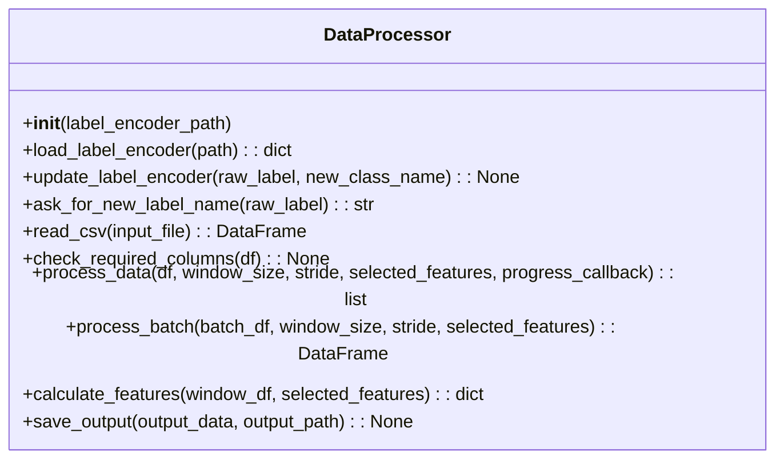

# Engineering Report: Integrated Sensor Data Acquisition, Processing, and Visualization System

This report provides a comprehensive overview of an integrated system composed of four major software components. The system is designed to acquire environmental sensor data, extract features from raw measurements, train and run machine learning models for classification, and offer real-time logging and visualization. The main components include:

1. **Embedded Firmware (Arduino/C++)** – Interfaces with multiple BME68x sensors, configures heater profiles, processes serial commands, and streams sensor data.
2. **Model Trainer GUI (Python/Tkinter)** – Processes sensor data, performs feature extraction and windowing, trains a machine learning model (RandomForestClassifier), and handles batch predictions.
3. **Data Logger GUI (Python/Tkinter)** – Provides real-time data logging, dynamic plotting of sensor data, and retrieval of heater profile configurations.
4. **Data Processor Module (Python)** – Contains functions and a `DataProcessor` class to extract statistical and dynamic features from sensor data, manage label encoding, and process raw CSV files into a format suitable for machine learning.

Below is a detailed explanation of each component, followed by diagrams illustrating the design and interactions within the system.

---

## 1. Embedded Firmware

### Overview
The firmware runs on an Arduino-compatible board and is responsible for:
- **Sensor Initialization and Configuration:**  
  - Initializes 8 BME68x sensors via a communication multiplexer.
  - Sets up temperature, pressure, and humidity (TPH) settings.
  - Applies one of four predefined heater profiles to each sensor.

- **Serial Communication and Command Handling:**  
  - Listens for commands such as `START`, `STOP`, `SEC_`, and `GETHEAT` via the serial port.
  - Streams sensor data in CSV format, including a timestamp, a label tag (modifiable via button presses), and heater profile information.

- **User Interaction through Buttons:**  
  - Implements debouncing and state tracking for two buttons.
  - Supports both single button presses (to adjust a label value) and simultaneous presses (to cycle through heater profile assignments).

### Key Functions
- **Initialization (`setup()`):**  
  Configures serial communications, sensor interfaces, heater profiles, and GPIO pins.
- **Main Loop (`loop()`):**  
  Processes serial commands, handles button presses, and periodically collects and transmits sensor data.
- **Heater Profile Management:**  
  Functions like `initializeHeaterProfiles()`, `setHeaterProfile()`, and `getHeaterProfiles()` manage the heater configurations.
- **Error Handling:**  
  The `errLeds()` function provides visual error signaling via an LED.

---

## 2. Model Trainer GUI

### Overview
This Python/Tkinter application allows users to:
- **Load and Process Training Data:**  
  Uses a separate `DataProcessor` (described later) to read CSV files, window the data, and extract features.
- **Train a Machine Learning Model:**  
  Trains a `RandomForestClassifier` using extracted features with sample weighting to address class imbalance.
- **Run Predictions and Display Metrics:**  
  Processes new data for prediction, computes accuracy and other metrics, and shows detailed classification reports.
- **Real-Time Predictions:**  
  Connects to the embedded device via a serial port to receive live sensor data and provides immediate classification feedback.

### Key Features
- **File Browsing and Progress Feedback:**  
  Interface elements for selecting input files and visual progress bars during training and prediction.
- **Background Processing:**  
  Uses threading to handle data processing and model training/prediction without freezing the GUI.
- **Metrics Saving and Loading:**  
  Saves performance metrics in a JSON file (`model_metrics.json`) for later review.

---

## 3. Data Logger GUI

### Overview
This Python/Tkinter application is designed for:
- **Real-Time Data Logging:**  
  Reads sensor data streamed from the embedded firmware via a serial connection and logs it into CSV files.
- **Dynamic Plotting:**  
  Displays live plots of sensor parameters (e.g., temperature, pressure, humidity) using matplotlib.
- **Heater Profile Retrieval:**  
  Sends a `GETHEAT` command to obtain the heater profile configurations from the firmware and displays them in a formatted popup.

### Key Features
- **Serial Port Management:**  
  Lists available ports, allows connection/disconnection, and supports refreshing of port lists.
- **Data Parsing and Storage:**  
  Processes CSV lines, updates a pandas DataFrame with a sliding time window, and synchronizes GUI display with incoming data.
- **Real-Time Plot Updates:**  
  Allows selection of sensor parameters and time windows (from 1 minute to 120 minutes) for visualization.
- **User Feedback:**  
  Includes status bars, error messages, and confirmation dialogs to ensure smooth user interactions.

---

## 4. Data Processor Module

### Overview
The Data Processor module is responsible for transforming raw sensor data into a set of features suitable for machine learning. It performs the following tasks:
- **Feature Calculation:**  
  Computes statistical measures (mean, standard deviation, minimum, maximum) for sensor readings such as gas resistance, temperature, pressure, and humidity. It also computes additional features such as the range and slope for gas resistance.
- **Windowing:**  
  Splits the continuous sensor data into fixed-length windows (with a given stride) ensuring each window has a unique label.
- **Label Encoding:**  
  Loads a CSV file mapping raw numeric labels to human-readable class names. If a new label is encountered during processing, the module prompts the user for a new class name and updates the encoder.
- **Data Output:**  
  Processes the windowed data into a list of feature dictionaries or a processed DataFrame, and provides functionality to save the processed data to a CSV file.

### Key Functions and Class Methods
- **Feature Calculation Functions:**  
  Functions such as `calculate_gasresistance_mean()`, `calculate_temperature_std()`, etc., extract basic statistics from sensor columns.
- **`get_feature_functions()`:**  
  Constructs a dictionary mapping feature names to lambda functions that wrap the feature calculation functions.
- **`DataProcessor` Class:**
  - **Initialization:**  
    Loads the label encoder mapping from a CSV file.
  - **`read_csv()`:**  
    Reads sensor data from a CSV file and returns a pandas DataFrame.
  - **`check_required_columns()`:**  
    Validates that the necessary columns exist in the input data.
  - **`process_data()` and `process_batch()`:**  
    Splits the data into windows, extracts features using the provided feature functions, and ensures that each window contains a single label.
  - **`calculate_features()`:**  
    Iterates over selected feature functions to compute feature values for a given window.
  - **`save_output()`:**  
    Saves the processed feature data to a CSV file.

### UML Class Diagram for DataProcessor



---

## System Integration and Design Diagrams

### High-Level System Architecture

```mermaid
flowchart TD
    A[Embedded Firmware<br/>(Sensor Data Acquisition)]
    B[Data Logger GUI<br/>(Real-Time Logging & Visualization)]
    C[Model Trainer GUI<br/>(Data Processing & ML Training)]
    D[Data Processor Module<br/>(Feature Extraction & Label Encoding)]
    E[Machine Learning Model<br/>(RandomForestClassifier)]
    F[Processed Data CSV]

    A --> B
    A --> C
    B --> D
    C --> D
    D --> E
    D --> F
```

### Data Flow Diagram

1. **Sensor Data Acquisition:**  
   - The embedded firmware collects data from up to 8 sensors and streams CSV-formatted data via serial communication.

2. **Real-Time Logging & Visualization:**  
   - The Data Logger GUI connects to the firmware, receives live data, and logs it to a CSV file.
   - It also visualizes the incoming data in real time.

3. **Data Processing and Model Training:**  
   - Both the Model Trainer GUI and the Data Logger GUI leverage the Data Processor module to:
     - Split raw data into fixed-length windows.
     - Extract features using statistical functions.
     - Encode labels based on an external CSV file.
   - Processed data is then used to train a RandomForest model or for making predictions.

4. **Output and Metrics:**  
   - Processed feature data is saved as CSV files.
   - Model metrics and predictions are computed and displayed in the Model Trainer GUI.

---

## Conclusion

This integrated system combines low-level sensor interfacing with high-level data processing and machine learning components. The firmware efficiently gathers sensor data and manages sensor configurations (heater profiles), while the Python-based GUIs provide robust tools for data logging, real-time visualization, and model training. The Data Processor module plays a crucial role in converting raw sensor measurements into actionable features, facilitating accurate classification by the machine learning model.
